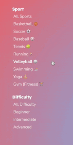

 
Hate working out alone? Make new friends while playing your favorite sports with Pacer!
MERN stack social platform for sports meetups by location and skill level with Google Maps API integration.

[Live Demo](https://pacer-65mk.onrender.com/)
 
 

## Tech Stack
- MongoDB
- ExpressJS
- React.js
- Node.js

## Features
1. User Auth
2. Events (CRUD) w/ Interactive Google Map
3. Google Maps API Integration
4. User Profiles
5. Discover Events
6. Event Social Stats
7. Event Comments
 

 

## Notable Highlights
### User Auth

 
*testcaption*

## Challenges

## Team
- Gary Jiang
- Jason Jun
- Francis Cawog
- Robert Lee
