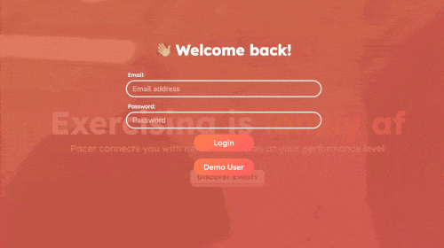

## Idea
*"I hate running alone but my friends run way too fast. I wish I had my own personal Pacer..."*
  
In the world of running *pacers* play a crucial role by setting a consistent speed to help runners achieve their target times in a race.
  
The *Pacer* platform helps you connect with people playing your favorite sport at similar performance levels so you can train, bond, and celebrate together.
  
👉
[Live Demo](https://pacer-65mk.onrender.com/)
👈
 

## Features
1. User Auth
2. Events (CRUD) w/ Interactive Google Map
3. Google Maps API Integration (Dynamic Map, Static Map, & Places API)
4. User Profiles
5. Discover Events Page
6. Event Social Stats
7. Event Comments (CRUD)
 

## Plan
1. Audience Value Props

  

2. App Architecture & Data Flow

3. Design

## Tech Stack
- MongoDB
- ExpressJS
- React.js
- Node.js
 

## Notable Highlights

 *User Authentication Modals* 

 *Event Filter* 

 *Google Maps API Integration* 
 

## Implementation
### Data Architecture with Mongoose & MongoDB
- Events, Users, Comments
  - Schemas
  - Models
    - Three different models: events, users, and comments. Comments are the most compact model and is shown below. 
    
  - Validations
     - Used in our post routes before creating an object in our database
- Google Maps API
- 
- We integrated/hit three different Google Maps API endpoints for this project: a dynamic map on the events show page (as shown above), a static map for each event preview in the discover page and a places API autocomplete for creating and editing an event (queries the API with a string and returns possible locations - similar to how the Google Maps Application search bar works).
- 

### Routing with Express.js
- Users
- Events
- Comments
- 
- Both Events and Comments were full CRUD (Create, Read, Update, and Delete). We followed RESTful API practices for our backend routes. 

### Main React.js Components
- Events Page
- Discover Page
 - Most of the logic for our Discover page component was creating an event at the top of the page, which triggers a sign-in if not logged in, a filtering logic based on both difficulty of the event and the sport for the event. A useEffect hook was used every time the useState variables for our filters were changed and the component would update and re-render.

### State Management with Redux
- Events
- 
- Users
- Comments
  

## Challenges
1. New tech stack & three days to learn it
  - Mainly learning how to use Express.js for backend routes and Mongoose/MongoDB for models and storage within a weekend
2. Google Maps and parsing location data
  - Integrating three sub-API queries (dynamic map, static map and places api autocomplete) and integrating into react components
3. Handling bugs
  - Finding bugs sometimes was difficult but overall, gave us a chance to understand the entire stack more by tracing the bug from the through the whole stack, especially since one request could have multiple bugs along the way, with developers working on different parts of the application at the same time. To trace all the bugs, we would check our backend logs and our frontend console logs for errors, and then check the middle which could've been problems with our reducers or our thunk actions for instance. Doing this multiple times gave us a better idea of how to find our bugs in a fullstack application fairly quickly.
4. Going from a SQL database (structured tables) to a NoSQL database (document-based)
5. Learning to work together as a team and splitting workload

  

## Team
### Gary Jiang
*Team & Frontend Lead* 
[Github](https://github.com/garysbot) 
[Website](https://imgaryjiang.com) 
[LinkedIn](https://linkedin.com/in/garyjiang) 

### Jason Jun
*Flex Lead* 
[Github](https://github.com/junjason) 
[Website](https://www.junjason.com) 
[LinkedIn](https://www.linkedin.com/in/jason-jun-0a7576237/) 

### Francis Cawog
*Backend Lead* 
[Github](https://github.com/garysbot) 
[Website](https://imgaryjiang.com) 
[LinkedIn](https://linkedin.com/in/garyjiang) 

### Robert Lee
*Flex* 
[Github](https://github.com/garysbot) 
[Website](https://imgaryjiang.com) 
[LinkedIn](https://linkedin.com/in/garyjiang) 

